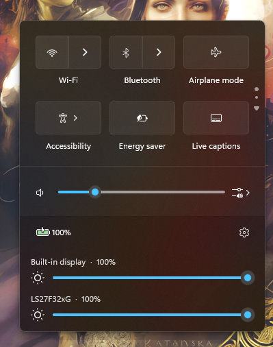

# Per-monitor brightness in Quick Settings

A [Windhawk](https://windhawk.net/) mod that adds a labelled brightness slider
for every connected display to the Windows 11 Quick Settings panel, each showing
its live level and carrying the shell's own animated brightness icon.

Windows gives you exactly one brightness slider no matter how many monitors you
have, and on a desktop it gives you none at all.

Each display is driven over whichever channel actually works for it:

- **External monitors** use **DDC/CI** (VCP code `0x10`), the I2C side-channel
  in the video cable that the monitor's own on-screen menu uses. Most monitors
  made in the last decade support it; some budget panels and some USB-C docks
  do not.
- **Laptop internal panels** use **WMI**, the same path the stock slider takes.

A display that answers neither is listed as uncontrollable rather than being
silently dropped.

## Features

- One titled slider per display, showing the live percentage.
- Ordered left to right to match how the monitors sit on your desk.
- Displays keyed by EDID device path, so the right slider follows the right
  monitor across hotplug, reordering and reboots.
- Each slider snaps to what its monitor can actually represent. Panels do not
  all use a 0–100 scale — a Samsung G32 reports 0–50 — so offering 1% steps
  would just mean several slider positions that write the same value.
- Function keys move the sliders live, and can optionally drive external
  monitors too, which they cannot do on their own.
- Monitors plugged in or unplugged are picked up immediately.
- Values re-read whenever the panel opens, catching changes made elsewhere.
- The stock brightness slider can be hidden, since it duplicates the internal
  panel's row.
- The sliders sit with the Windows ones by default, and can be moved above them
  or down to the bottom of the flyout.
- Displays that cannot be controlled can be hidden.

## Settings

| Setting | Default | Effect |
|---|---|---|
| Where to put the sliders | `belowSliders` | Joins the card holding the volume and stock brightness rows. `aboveSliders` puts it first in that card; `bottom` is under the settings button, outside the card, as before 2.1 |
| Hide displays that cannot be controlled | off | Leaves out displays that answer neither transport. They are still re-checked, so one that starts answering appears |
| Hide the built-in brightness slider | on | Collapses the stock row, which only controls the internal panel |
| Laptop brightness keys control every monitor | `off` | `relative` shifts others by the same delta, preserving their offsets; `match` sets them all equal |

The second one is off by default because Windows raises the same signal for a
brightness key, for the power plan's AC and battery levels, and for idle
dimming, with no way to tell them apart — so with it on, unplugging the charger
would also write to every external monitor. Unlike everything else this mod
does, that write is not undone by turning the setting off or disabling the mod:
the monitor stores the value itself.

## Limitations

- A DDC/CI write takes roughly 50–60 ms and the bus saturates while dragging, so
  an external monitor visibly steps rather than fades. The internal panel is
  around ten times faster and looks smooth. Nothing can be done about this from
  software — it is the cable.
- DDC/CI has no notification channel: a monitor only ever answers what the host
  asks it. Brightness changed using the monitor's own buttons cannot be
  detected, and only shows up the next time the panel is opened.
- Not every monitor implements DDC/CI correctly. One that does not answer at
  all is listed as uncontrollable and gets no slider; one that answers but
  misbehaves shows up as writes reporting `ok=0`, which you can see by enabling
  logging for the mod in Windhawk's settings.
- A monitor that was asleep, switched to another input, or behind a dock still
  enumerating when you signed in will fail that first check. It is retried
  rather than written off: opening the panel again re-probes it, backing off
  from 30 seconds to at most 16 minutes between attempts, and unplugging and
  replugging it starts over immediately.

## Installing

Install [Windhawk](https://windhawk.net/), then either install this mod from the
[mods catalogue](https://windhawk.net/mods), or create a new mod and paste in
[`per-monitor-brightness.wh.cpp`](per-monitor-brightness.wh.cpp).

Requires Windows 11 with the redesigned Control Center.

Developed and tested on **25H2 (build 26200)**, where the Control Center is
hosted by `ShellHost.exe`. Earlier Windows 11 builds host it in
`ShellExperienceHost.exe` and are not supported -- see the compatibility note
in the mod's own readme for why that process is deliberately left out.

## Development

See [DEVELOPING.md](DEVELOPING.md) for the build process and notes on the
undocumented platform behaviour this relies on.

## Licence

GPLv3, and adapted in part from m417z's
[Windows 11 Notification Center Styler](https://github.com/ramensoftware/windhawk-mods/blob/main/mods/windows-11-notification-center-styler.wh.cpp),
which is GPLv3.

What is borrowed has changed. This mod used to carry that mod's
XAML-diagnostics plumbing — `VisualTreeWatcher`, `WindhawkTAP`,
`InjectWindhawkTAP` — and none of it is here any more: XAML diagnostics allows
one consumer per process, so holding the slot stopped that very mod theming the
Control Center. Discovery is a symbol hook now.

What remains adapted is the synchronous hop onto the XAML thread in
`RunOnXamlThread`: a `WH_CALLWNDPROC` hook plus `SendMessage` of a registered
message, which is the approach behind its `RunFromWindowThread`.
